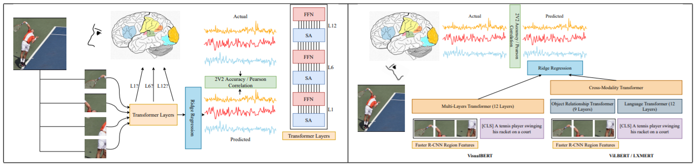

# visio-linguistic-brain-encoding

[Visio-Linguistic Brain Encoding](https://aclanthology.org/2022.coling-1.11.pdf), COLING-2022



[BOLD5000_dataset](https://figshare.com/articles/dataset/BOLD5000_Release_2_0/14456124)

* BOLD5000 dataset statistics:


[Pereira_dataset](https://figshare.com/articles/dataset/BOLD5000_Release_2_0/14456124)

* Pereira dataset statistics:

  
## Slides

[slides](https://docs.google.com/presentation/d/1OZuMMK6rC6B1YPmkA5bwCsF2AMn9oWDS/edit?usp=sharing&ouid=100565237099472127436&rtpof=true&sd=true)

## Video
[video](https://drive.google.com/file/d/1olIwiI5syxblk6QEQXMfsiqKLYcRUug-/view?usp=sharing)

## For Citation of our work
```
@inproceedings{oota2022visio,
  title={Visio-Linguistic Brain Encoding},
  author={Oota, Subba Reddy and Arora, Jashn and Rowtula, Vijay and Gupta, Manish and Bapi, Raju S},
  booktitle={Proceedings of the 29th International Conference on Computational Linguistics},
  pages={116--133},
  year={2022}
}
```
